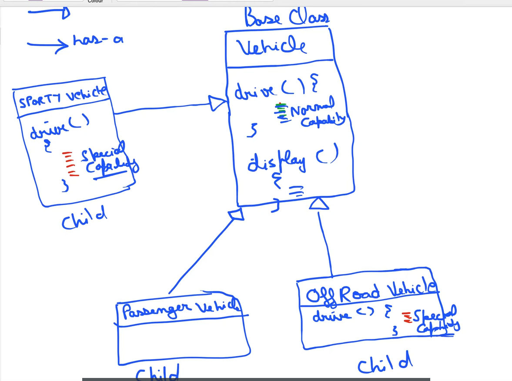

## Back to Basics

There are two type of Inheritance.


-   class extends another classes, and class of parent interface, implements another class.

#### Problem ?

The problem is suppose we have `Vehicle` and we make different child of this Vehicle like `SportVehicle`, `PassengerVehicle` and, `OffroadVehicle`.

Vehicle class have different features like `drive()`, `display()`, `fuelCapcity()` now its childrens `SportVehicle` and, `OffroadVehicle` want their own features like `driveCapibilty()`, then we need to make same code into both the child then code will duplicate here.

Here we needed own features because they are not using the Base class features.

see the below digram


---------------- -fig 1.2----------------

```java
public class Vehicle{
    void drive();
    void diplay();
    void fuelCapicity();
}
```

```java
public class SportVehicle extends Vehicle{
    @override
    public void drive(){
        //making own drive code
        //special drive capibilty
    }
}
```

```java
public class OffRoadVehicle extends Vehicle{
    @override
     public void drive(){
        //making own drive code
        //special drive capibilty
    }
}
```

```java
public class PassengerVehicle extends Vehicle{
     public void drive(){
        // same as Base class
    }
}
```

This problem can be simply solved by the `Strategey Design Patterns`

we created interface `DriveStrategy` and implements the different child from this base class so later on when have different Drive class we can simply implements it from the `DriveStrategy` interface.

```java
public interface DriveStrategy{
    public void drive();
}
```

```java
public class NormalDriveStartegy implements DriveStrategy{
    @override
    public void drive(){
        System.Out.Println("Normal Drive Capibility");
    }
}
```

```java
public class SprotsDriveStartegy implements DriveStrategy{
    @override
    public void drive(){
        System.Out.Println("Sports Drive Capibility");
    }
}
```

Now we will make `Vehicle` class , `Vehicle has a DriveStrategy` which means `Vehicle` would have `NormalDriveStartegy` and `SprotsDriveStartegy`

Let make `Vehicle class` which will be generic for any class

```java
public class Vehicle{

    //make it generic by not specifying like new NormalDriveStartegy()
    //something like this, so it is dynamic object
    DriveStrategy driveObject;

    //make constructor injections so that we can pass different object of different class
    Vehicle( DriveStrategy driveObject){
        this.driveObject =  driveObject;
    }

    public void drive(){
        //calling the drive method of driveObject
        driveObject.drive();
    }
}
```

In `OffRoadVehicle` let call the `SprotsDriveStartegy` drive() method, it won't have its own drive capability

```java
public class OffRoadVehicle implements Vehicle{

    //call the constructor with sportDriveStrategy
    OffRoadVehicle(){
        super(new SprotsDriveStartegy());
    }
}
```

Now create `SportsVehicle`

```java
public class SportsVehicle implements Vehicle{

   //call the constructor with sportDriveStrategy
   SportsVehicle(){
       super(new SprotsDriveStartegy());
   }
}
```

GoodsVehicle class

```java
public class GoodsVehicle implements Vehicle{

    //call the constructor with sportDriveStrategy
    GoodsVehicle(){
    super(new NormalDriveStartegy());
    }
}

```

Main.java

```java
    public class Main{

        public static void main(String args[]){

                Vehicle vehicle = new GoodsVehicle();
                vehicle.drive();//ouput is --->> "Normal Drive Capibility"
                //ex 2
                Vehicle vehicle = new SportsVehicle();
                vehicle.drive();//ouput is --->> "Sports Drive Capibility"
        }
    }
```
